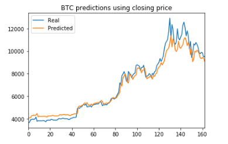
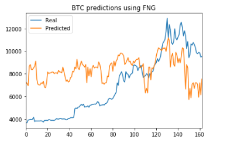

# Deep Learning Homework
## James Phalen 
## FinTech

### Model Parameters used in both models:
1. Number of Nodes: 30
1. Dropout Fraction: 0.5
1. Number of Layers: 4
1. Batch Size: 60
1. Number of Epochs: 250
1. Validation data was used for X and y
# 
## LSTM RNN model using Closing Prices:

### Loss Value: 0.003376810142964673
#
## LSTM RNN model using Fear and Greed:

### Loss Value: 0.0908465517079172
#
## Conclusion
1. The model that used closing prices had a lower loss value
1. The model that used closing prices tracks the actual values better over time 